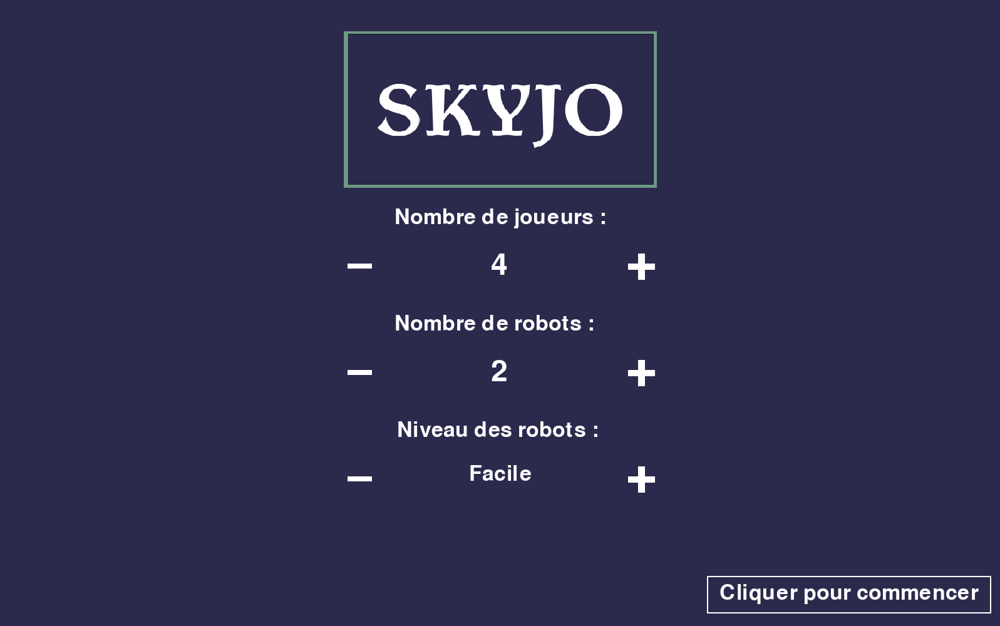
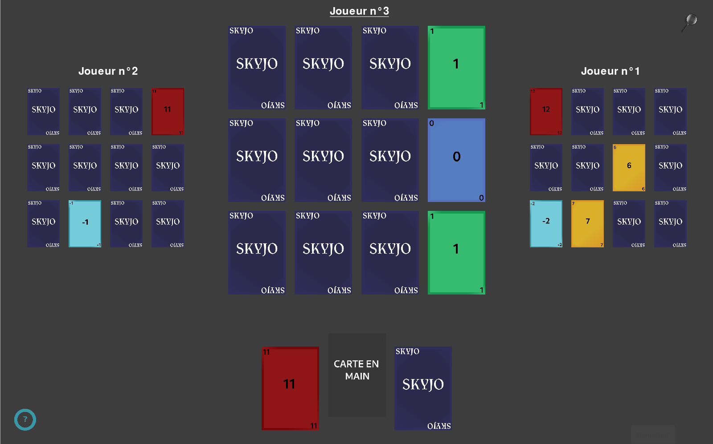
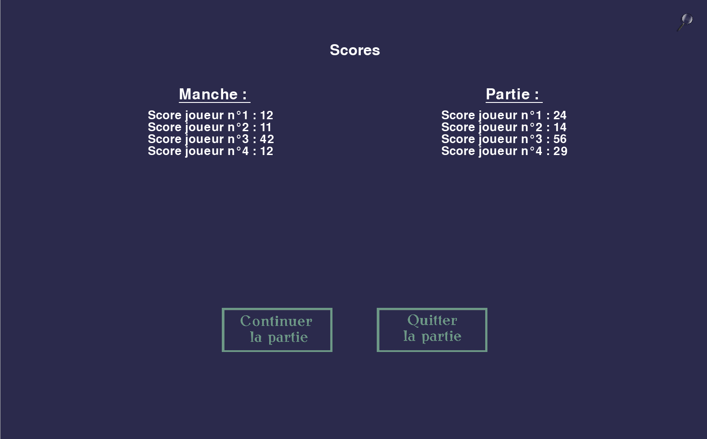

# Projet concrétisation de L1

## Objectif  
Le but de ce projet est de programmer le jeu de société _"Skyjo"_.  
Nous avons codé en Python et avons également utilisé la bibliothèque [Pygame](https://www.pygame.org/docs/)


## Quelques images  
  
  
  


## Instructions d'utilisation

Prérequis :  
-[python3](https://www.python.org/downloads/)  
-[pygame](https://www.pygame.org/wiki/GettingStarted)


Pour lancer le jeu :  
1. Télécharger tous les fichiers du dépôt (le dossier /web et le .gitignore ne sont pas nécéssaire)
   ```git clone https://github.com/MaxiLan/concretisation-l1```
2. Exécuter le fichier `main.py`
   ```python3 main.py```
3. Profiter ! (il est fortement conseiller d'utiliser une souris plutôt que le pavé tactile)

## Comment jouer ?

Les règles du _Skyjo_ sont disponibles sur notre site web,  
Lui-même accessible dans le dossier /web (le fichier index.html pour être plus précis).  
Lorsque vous jouez, une aide est disponible en bas à gauche de l'écran.  
Elle vous dit que faire selon la situation.